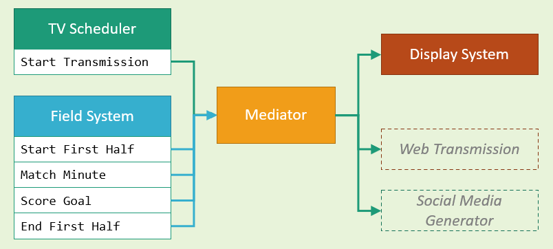

# CSharp Design Patterns

## Behavioral patterns

1. Mediator 
2. Chain Of Responsibility I
3. Data Pipeline
4. Strategy
5. Visitor
6. Chain of Responsibility II - Chained Workflows

## Mediator Demo: Soccer Match System

Components:
* Scheduler - game broadcasting system
* Field System - game events generator
* Display System - on-screen game information (for demo purpose console is used as the display)

